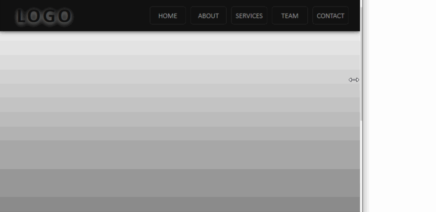
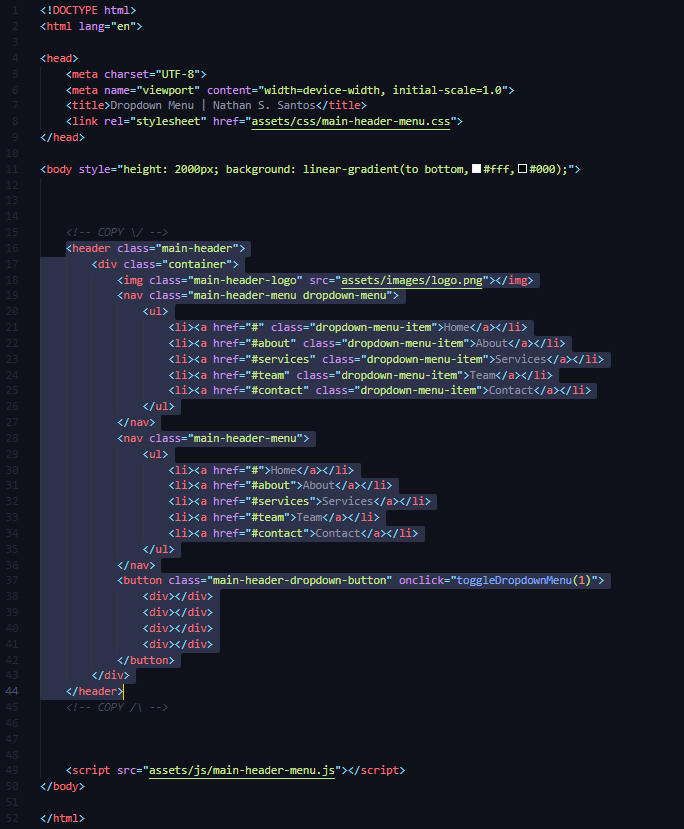

# Side Menu Component

Fully responsive and ready to use side menu component.

Developed using:
* HTML 5
* CSS 3
* JavaScript

No plugins, no libraries. Just Vanilla JS. 

[Live demo](http://nathanssantos.github.io/side-menu-component)

## Usage instructions

* [Download the project](https://github.com/nathanssantos/side-menu-component/archive/master.zip)
* Open the file `index.html` on a text editor and copy the amount of code between the two "COPY" tags, following the example below, to the place on your project were you do want to implement the component.

* Make sure that you have the correct links to the side menu CSS and JS assets files on your project.

## Authors

Nathan S. Santos - [LinkedIn](https://www.linkedin.com/in/nathan-s-santos-4b2637163/) / [GitHub](https://github.com/nathanssantos) 

## License

This project is licensed under the MIT License - see [LICENSE.md](LICENSE.md) for details.
